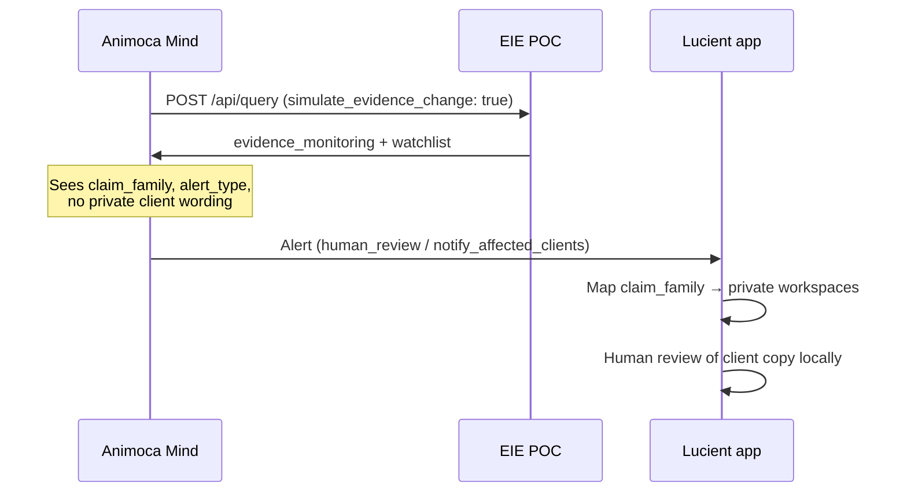

# Evidence-change monitoring simulation (Phase 8)

> **Later phases:** Phase 8 simulation on `/api/query` was followed by real PubMed monitoring on `/api/watch/check` (Phase 9) and scheduled runs with durable baseline on `/api/watch/run-due` (Phases 10–11).

Phase 8 simulates the core Evidence Mind use case: the **Lucient app** checks whether a claim is supportable today, while the **Evidence Mind** watches whether evidence behind a **claim family** changes over time.

The existing `POST /api/query` endpoint is unchanged in default behavior. When `filters.simulate_evidence_change` is `true`, responses include a top-level `evidence_monitoring` object with simulated deltas, policy impact, and alert routing.

## Purpose of Phase 8

1. **Demonstrate the monitoring loop** — baseline snapshot → current check → evidence delta → alert.
2. **Exercise alert routing** — Mind receives abstract alerts; the app maps claim families back to private workspaces.
3. **Simulate policy impact** — show when regulatory warnings tighten policy vs when new studies only trigger human review.
4. **Bridge Phase 7.5 watchlists to actionable monitoring** — watch topics become checkable claim-family baselines.

This is a proof of concept at Phase 8 scope — simulated deltas only on `/api/query`. Real PubMed diffing and durable persistence are documented in Phases 9–11.

## Why this gives Mind a stronger role

Before Phase 8, Mind received a one-off evidence brief and a static watch topic. Phase 8 lets Mind:

- Hold a **baseline evidence snapshot** per claim family
- Detect **simulated evidence signals** (new studies, systematic reviews, regulatory warnings)
- Route **alerts** (`monitor`, `human_review`, `notify_affected_clients`) without seeing private client copy
- Recommend **policy updates** when regulatory risk increases

Mind becomes an ongoing evidence sentinel, not just a brief generator.

## Request filters

| Filter | Default | Description |
|--------|---------|-------------|
| `simulate_evidence_change` | `false` | When `true`, include `evidence_monitoring` in the response |
| `simulated_change_type` | `"none"` | Scenario to simulate (see below) |

```json
{
  "workspace_id": "demo-magnesium",
  "query": "Magnesium for cortisol regulation",
  "mode": "evidence_brief",
  "filters": {
    "simulate_evidence_change": true,
    "simulated_change_type": "potentially_material_new_source"
  }
}
```

Phase 7 PubMed retrieval and Phase 7.5 watchlist fields remain unchanged. Monitoring simulation is independent of stub vs PubMed mode.

## Simulated change types

| `simulated_change_type` | Signal | Change level | Alert |
|-------------------------|--------|--------------|-------|
| `none` | none | `none` | `alert_required: false`, `alert_type: "none"` |
| `weak_new_source` | `new_study` (indirect) | `minor` | `alert_type: "monitor"` |
| `potentially_material_new_source` | `systematic_review` | `possible_material` | `alert_required: true`, `alert_type: "human_review"` |
| `regulatory_warning` | `regulatory_warning` | `material` | `alert_required: true`, `alert_type: "notify_affected_clients"` |

All signals set `new_evidence_signal.simulated: true`.

### Magnesium / cortisol baseline (claim family `magnesium_cortisol_stress`)

When the query maps to this family:

- `baseline_evidence_grade`: `"low"`
- `baseline_policy`: matches Phase 7.5 `current_policy` — *Avoid direct cortisol-regulation claims; use relaxation/general wellbeing wording unless stronger direct human evidence emerges.*
- `baseline_summary`: *Current evidence is largely indirect, with no substantiation for direct cortisol-regulation claims in healthy wellness consumers.*
- `baseline_date`: `"2026-05-25"` (fixed POC baseline)

## Alert flow: Mind → app



| Field | Meaning |
|-------|---------|
| `affected_claim_family_id` | Abstract family Mind can track |
| `affected_workspace_ids_visible_to_mind` | Always `false` in POC |
| `app_should_map_to_private_workspaces` | Always `true` — app owns client mapping |

## Privacy boundary

Phase 8 preserves the Phase 7.5 privacy model:

- Mind receives claim family IDs, watch topic IDs, simulated evidence deltas, and alert types.
- Mind does **not** receive client exact wording, brand copy, workspace IDs, or commercial strategy.
- The Lucient app maps `affected_claim_family_id` to private workspaces and notifies humans locally.

## Example request / response

### Default (no simulation)

```bash
curl -s -X POST "$BASE_URL/api/query" \
  -H "Content-Type: application/json" \
  -H "Authorization: Bearer $EIE_TOOL_API_KEY" \
  -d '{
    "workspace_id": "demo-magnesium",
    "query": "Magnesium for cortisol regulation",
    "mode": "evidence_brief"
  }' | jq 'has("evidence_monitoring"), .evidence_notes.monitoring_note'
```

Expected: `false` for `has("evidence_monitoring")`; `monitoring_note` present on `evidence_notes`.

### Potentially material new source

```bash
curl -s -X POST "$BASE_URL/api/query" \
  -H "Content-Type: application/json" \
  -H "Authorization: Bearer $EIE_TOOL_API_KEY" \
  -d '{
    "workspace_id": "demo-magnesium",
    "query": "Magnesium for cortisol regulation",
    "mode": "evidence_brief",
    "filters": {
      "simulate_evidence_change": true,
      "simulated_change_type": "potentially_material_new_source"
    }
  }' | jq '.evidence_monitoring.evidence_delta, .evidence_monitoring.evidence_change_alert'
```

Expected: `change_level: "possible_material"`, `alert_type: "human_review"`.

### Regulatory warning

```bash
curl -s -X POST "$BASE_URL/api/query" \
  -H "Content-Type: application/json" \
  -H "Authorization: Bearer $EIE_TOOL_API_KEY" \
  -d '{
    "workspace_id": "demo-magnesium",
    "query": "Magnesium for cortisol regulation",
    "mode": "evidence_brief",
    "filters": {
      "simulate_evidence_change": true,
      "simulated_change_type": "regulatory_warning"
    }
  }' | jq '.evidence_monitoring.policy_impact, .evidence_monitoring.evidence_change_alert'
```

Expected: `policy_change_recommended: true`, `alert_type: "notify_affected_clients"`, more conservative `recommended_policy`.

## `evidence_notes.monitoring_note`

Every response includes:

> Phase 8 simulates evidence-change detection and alert routing for claim families. This is not yet real background monitoring.

## Limitations

- **No persistence** — baseline snapshots are generated per request, not stored.
- **No real change detection** — all signals are simulated via `simulated_change_type`.
- **No scheduler** — `next_recommended_check_utc` is computed but nothing runs checks automatically.
- **Fixed baseline date** — `2026-05-25` for POC consistency.
- **Keyword-driven claim families** — same limitations as Phase 7.5 classification.
- **Demo data only** — do not send real client-private data.

## Source files

| File | Role |
|------|------|
| `lib/evidence-monitoring.ts` | Simulation scenarios and `buildEvidenceMonitoring()` |
| `lib/query-response.ts` | Optional `evidence_monitoring` on response |
| `lib/evidence-stubs.ts` | `monitoring_note` on `evidence_notes` |
| `app/api/query/route.ts` | Validates `simulated_change_type` |

## Related docs

- [evidence-watchlist-architecture.md](./evidence-watchlist-architecture.md) — Phase 7.5 watch topics and privacy boundary
- [pubmed-appraisal-rules.md](./pubmed-appraisal-rules.md) — Phase 7 appraisal (unchanged)
- [magnesium-test.md](./magnesium-test.md) — base API reference
