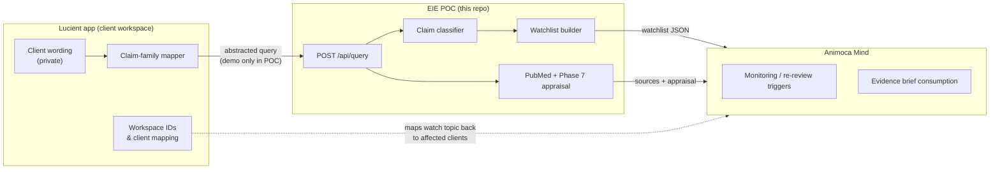

# Evidence watchlist architecture (Phase 7.5)

Phase 7.5 reframes the Lucient Evidence Mind POC from one-off evidence brief generation toward **evidence watchlists** and **evidence-change monitoring**.

The existing `POST /api/query` endpoint is unchanged in request shape. Responses now include a top-level `watchlist` object alongside the Phase 7 appraisal output.

## Purpose of Phase 7.5

1. **Abstract client claims into claim families** — Mind receives generalized watch topics, not private client copy.
2. **Define monitoring intent** — priority, check frequency, review triggers, and current policy per claim family.
3. **Reserve evidence-change status** — structured fields for future diffing (`not_checked` in this POC).
4. **Document privacy boundaries** — what Mind may receive vs what stays in the Lucient app.

This is a proof of concept. There is no database, no scheduled checks, and no real change detection yet.

## Roles: App vs EIE vs Mind



| Role | Responsibility |
|------|----------------|
| **Lucient app** | Holds client-private wording, brand copy, workspace notes, and commercial context. Maps abstract watch topics back to affected clients. |
| **EIE POC** | Classifies queries, retrieves/appraises evidence (Phase 7), and emits abstracted `watchlist` metadata. Does not store client data. |
| **Animoca Mind** | Consumes watch topics and evidence status to decide when to request re-review or surface alerts — without seeing private client copy. |

## Private client wording → abstract claim families

The app (not Mind) owns the original marketing claim. Before calling EIE, production systems would send an **abstracted query** or claim-family identifier. In this POC, demo queries like `"Magnesium for cortisol regulation"` stand in for that abstraction.

Mapping flow:

1. **Classify** — keyword classifier assigns `claim_type` (e.g. `cortisol_hormone`).
2. **Refine** — for `cortisol_hormone`, if the query mentions both `magnesium` and `cortisol`, map to claim family `magnesium_cortisol_stress`.
3. **Emit watch topic** — stable `topic_id` (e.g. `watch-magnesium-cortisol`) that Mind can track across requests.

Mind never receives:

- Client exact wording
- Brand confidential copy
- Private workspace notes
- Commercial strategy

Mind does receive:

- Abstracted claim family
- Watch topic metadata
- Evidence change status (placeholder in POC)
- Source metadata and appraisal summary from the brief

## Example: magnesium / cortisol watch topic

Query: `"Magnesium for cortisol regulation"`

```json
{
  "watchlist": {
    "claim_family": "magnesium_cortisol_stress",
    "watch_topic": {
      "topic_id": "watch-magnesium-cortisol",
      "label": "Magnesium and cortisol/stress physiology",
      "description": "Monitors emerging human evidence and regulatory guidance on magnesium supplementation and cortisol or stress-physiology outcomes.",
      "monitoring_priority": "medium",
      "recommended_check_frequency": "monthly",
      "evidence_change_sensitivity": "moderate",
      "current_policy": "Avoid direct cortisol-regulation claims; use relaxation/general wellbeing wording unless stronger direct human evidence emerges.",
      "review_trigger_conditions": [
        "new human RCT involving magnesium and cortisol",
        "new systematic review or meta-analysis on magnesium and stress physiology",
        "new clinical guideline mentioning magnesium and cortisol/stress",
        "new regulatory warning about hormone-balancing or cortisol claims"
      ],
      "client_private_data_required": false
    },
    "evidence_change_status": {
      "status": "not_checked",
      "last_checked": null,
      "new_sources_since_last_check": [],
      "material_change_summary": null,
      "recommended_action": "none"
    },
    "privacy_boundary": {
      "mind_receives": [
        "abstracted claim family",
        "watch topic",
        "evidence status",
        "source metadata",
        "appraisal summary"
      ],
      "mind_does_not_receive": [
        "client exact wording",
        "brand confidential copy",
        "private workspace notes",
        "commercial strategy"
      ],
      "app_maps_back_to_clients": true
    }
  }
}
```

## How Mind triggers re-review without private copy

1. Mind stores `watch_topic.topic_id` and `claim_family` from each brief response.
2. On a scheduled check (future), Mind calls `POST /api/query` with the same abstracted query or a claim-family-specific demo query — **not** the client's original copy.
3. EIE returns updated `sources`, `appraisal`, and eventually populated `evidence_change_status` (e.g. `material_change`, `recommended_action: "human_review"`).
4. Mind compares `topic_id` + status; if action is required, it notifies the Lucient app via integration (out of scope for this POC).
5. The **app** maps `topic_id` → affected workspaces/clients and applies human review to private copy locally.

Mind never needs the client's exact sentence to detect that new PubMed evidence may affect the `watch-magnesium-cortisol` topic.

## Mapped claim types (Phase 7.5)

| `claim_type` | `claim_family` | `topic_id` | Priority | Frequency |
|--------------|----------------|------------|----------|-----------|
| `cortisol_hormone` (+ magnesium & cortisol in query) | `magnesium_cortisol_stress` | `watch-magnesium-cortisol` | medium | monthly |
| `cortisol_hormone` (otherwise) | `cortisol_hormone_regulation` | `watch-cortisol-hormone` | medium | monthly |
| `detox` | `detoxification_claims` | `watch-detox-claims` | high | monthly |
| `inflammation` | `inflammation_reduction` | `watch-inflammation-claims` | high | monthly |
| `sleep` | `sleep_quality` | `watch-sleep-quality` | medium | monthly |
| `experiential_wellness` | `experiential_wellness` | `watch-experiential-wellness` | low | quarterly |
| Other claim types | `general_claim_review` | `watch-general-claims` | medium | manual |

## `evidence_notes.watchlist_note`

Every response includes:

> Phase 7.5 introduces abstracted claim-family watch topics. These are designed for evidence monitoring without exposing client-private wording to the Mind.

## Limitations of this POC

- **No persistence** — watch topics are computed per request; nothing is stored between calls.
- **No change detection** — `evidence_change_status.status` is always `not_checked`; no diffing against prior snapshots.
- **No scheduling** — recommended check frequencies are advisory strings only.
- **No client mapping in API** — `app_maps_back_to_clients: true` documents intent; mapping logic lives in the Lucient app.
- **Keyword classification only** — claim families depend on simple query keywords, not NLP or client taxonomy.
- **Demo data only** — use synthetic workspace IDs and queries; do not send real client-private data.
- **Phase 7 appraisal unchanged** — skeptical PubMed appraisal rules remain as documented in [pubmed-appraisal-rules.md](./pubmed-appraisal-rules.md).

## Source files

| File | Role |
|------|------|
| `lib/evidence-watchlist.ts` | Watch topic configs and `buildWatchlist()` |
| `lib/query-response.ts` | Adds `watchlist` to `QueryResponse` |
| `lib/evidence-stubs.ts` | `watchlist_note` on `evidence_notes` |
| `lib/claim-classifier.ts` | Claim type input for watchlist mapping |

## Related docs

- [magnesium-test.md](./magnesium-test.md) — base API reference
- [dynamic-claim-tests.md](./dynamic-claim-tests.md) — claim classification
- [pubmed-appraisal-rules.md](./pubmed-appraisal-rules.md) — Phase 7 appraisal (unchanged)
