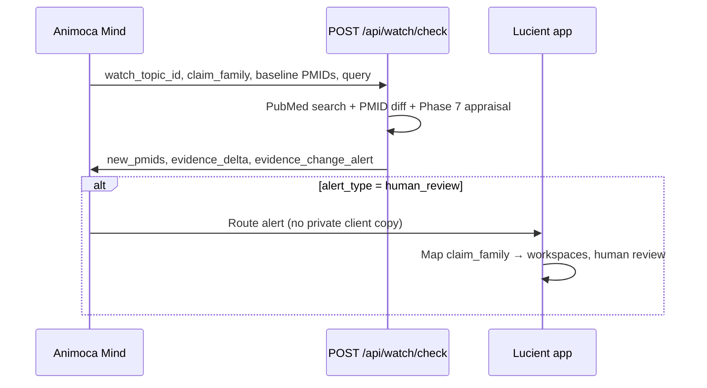

# Manual live watchlist check endpoint (Phase 9)

Phase 9 moves from **simulated** evidence-change monitoring (Phase 8) to a **manual live watchlist check** against PubMed.

Mind (or the Lucient app on Mind's behalf) sends a watch topic, claim family, baseline PMID list, and search query. The API runs a live PubMed search, detects PMIDs not in the baseline, appraises new records (Phase 7), and returns evidence deltas and alerts.

## Purpose of Phase 9

1. **Real PMID diffing** — compare live PubMed results against `baseline.known_pmids`.
2. **New source appraisal** — Phase 7 abstract retrieval and skeptical appraisal on unseen records only.
3. **Actionable alerts** — route `monitor`, `human_review`, or no alert based on appraisal strength.
4. **Manual trigger** — explicit `POST /api/watch/check` call; no scheduler yet.

Phase 8 simulation via `filters.simulate_evidence_change` on `/api/query` remains unchanged.

## Endpoint

| Method | Path | Auth |
|--------|------|------|
| `POST` | `/api/watch/check` | `Authorization: Bearer <EIE_TOOL_API_KEY>` |

## Request body

```json
{
  "workspace_id": "demo-phase-9",
  "watch_topic_id": "watch-magnesium-cortisol",
  "claim_family": "magnesium_cortisol_stress",
  "query": "Magnesium for cortisol regulation",
  "baseline": {
    "last_checked_date": "2026-01-01",
    "known_pmids": ["25365455", "37737441", "29450857"],
    "baseline_evidence_grade": "low",
    "baseline_policy": "Avoid direct cortisol-regulation claims; use relaxation/general wellbeing wording unless stronger direct human evidence emerges."
  },
  "filters": {
    "source_types": ["pubmed"],
    "recency_years": 10,
    "max_sources": 5,
    "use_real_pubmed": true
  },
  "context": "Phase 9 manual live watchlist check. No real client data."
}
```

| Field | Required | Notes |
|-------|----------|-------|
| `workspace_id` | Yes | Demo workspace ID only |
| `watch_topic_id` | Yes | Stable watch topic from Phase 7.5 |
| `claim_family` | Yes | Abstract claim family ID |
| `query` | Yes | PubMed search query (abstracted, not client copy) |
| `baseline.known_pmids` | Yes | Array of PMIDs already reviewed; may be `[]` to treat all results as new |
| `baseline.last_checked_date` | Yes | Last manual check date (echoed in response) |
| `baseline.baseline_evidence_grade` | Yes | Grade at baseline |
| `baseline.baseline_policy` | Yes | Policy at baseline |
| `filters` | No | Same PubMed filters as `/api/query`; requires `use_real_pubmed: true` and `source_types: ["pubmed"]` for live check |

## Response shape

Top-level fields: `watch_check_id`, `generated_at`, `workspace_id`, `watch_topic_id`, `claim_family`, `query_used`, `baseline`, `pubmed_check`, `new_sources`, `evidence_delta`, `policy_impact`, `evidence_change_alert`, `privacy_boundary`, `limitations`.

### `pubmed_check`

| Field | Description |
|-------|-------------|
| `status` | `success`, `error`, or `skipped` (PubMed not enabled in filters) |
| `records_found` | PMIDs returned by search (up to `max_sources`) |
| `known_records_found` | Count already in `baseline.known_pmids` |
| `new_records_found` | Count not in baseline |
| `new_pmids` | PMID strings for unseen records |

### `new_sources`

Only **new** records (not in baseline), using the same source object shape as `/api/query`, including `abstract` and `appraisal` when available.

## How baseline `known_pmids` work

1. Mind or the app stores PMIDs from the last check (or initial evidence brief).
2. On the next manual check, those PMIDs are sent in `baseline.known_pmids`.
3. The API searches PubMed and subtracts the known set.
4. Unseen PMIDs become `new_pmids` and are fetched, abstracted, and appraised.

If the search returns only known PMIDs, the response is a valid **no-change** result (`change_level: "none"`, `delta_confidence: 0.9`).

To force new-source detection in testing, send `"known_pmids": []`.

## Evidence delta rules

| Condition | `change_level` | `alert_type` |
|-----------|----------------|--------------|
| No new PMIDs | `none` | `none` |
| New PMIDs, weak/indirect appraisal | `minor` | `monitor` |
| New human RCT or systematic review with direct/partial intervention + outcome match | `possible_material` | `human_review` |

Policy auto-change is **not** recommended for `possible_material`; human review is required first.

## Alert flow



## Privacy boundary

| Mind receives | Mind does not receive |
|---------------|----------------------|
| Watch topic ID | Client exact wording |
| Claim family ID | Client / workspace IDs |
| Baseline PMID list | Brand confidential copy |
| Source metadata + appraisal summary | Private legal notes |

`affected_workspace_ids_visible_to_mind` is always `false`. The app maps claim families back to private workspaces locally.

## Example: no-change check

```bash
curl -s -X POST "$BASE_URL/api/watch/check" \
  -H "Content-Type: application/json" \
  -H "Authorization: Bearer $EIE_TOOL_API_KEY" \
  -d '{
    "workspace_id": "demo-phase-9",
    "watch_topic_id": "watch-magnesium-cortisol",
    "claim_family": "magnesium_cortisol_stress",
    "query": "Magnesium for cortisol regulation",
    "baseline": {
      "last_checked_date": "2026-01-01",
      "known_pmids": ["25365455", "37737441", "29450857"],
      "baseline_evidence_grade": "low",
      "baseline_policy": "Avoid direct cortisol-regulation claims; use relaxation/general wellbeing wording unless stronger direct human evidence emerges."
    },
    "filters": {
      "source_types": ["pubmed"],
      "use_real_pubmed": true,
      "max_sources": 5,
      "recency_years": 10
    }
  }' | jq '.pubmed_check, .evidence_delta, .evidence_change_alert'
```

Expected when search results are subset of known PMIDs: `new_records_found: 0`, `change_level: "none"`.

## Example: empty baseline PMIDs (force new detection)

```bash
curl -s -X POST "$BASE_URL/api/watch/check" \
  -H "Content-Type: application/json" \
  -H "Authorization: Bearer $EIE_TOOL_API_KEY" \
  -d '{
    "workspace_id": "demo-phase-9",
    "watch_topic_id": "watch-magnesium-cortisol",
    "claim_family": "magnesium_cortisol_stress",
    "query": "Magnesium for cortisol regulation",
    "baseline": {
      "last_checked_date": "2026-01-01",
      "known_pmids": [],
      "baseline_evidence_grade": "low",
      "baseline_policy": "Avoid direct cortisol-regulation claims; use relaxation/general wellbeing wording unless stronger direct human evidence emerges."
    },
    "filters": {
      "source_types": ["pubmed"],
      "use_real_pubmed": true,
      "max_sources": 5,
      "recency_years": 10
    }
  }' | jq '.pubmed_check.new_pmids, .new_sources | length, .evidence_delta'
```

Expected: all search PMIDs treated as new; `new_sources` populated with appraised records.

## Limitations

- **Manual only** — no cron, webhooks, or background jobs.
- **No persistence** — baseline PMIDs must be supplied on each request; nothing stored server-side.
- **Search window capped** — `max_sources` (default 3, max 5) limits PubMed results; records outside the window are not diffed.
- **Basic query construction** — same keyword search as `/api/query`; no MeSH optimization.
- **Conservative appraisal** — Phase 7 rules may under- or over-flag material changes; not final grading.
- **Demo data only** — synthetic workspace IDs and abstracted queries.

## How this becomes scheduled later

1. **App stores baselines** — persist `known_pmids`, `last_checked_date`, and policy per watch topic per workspace mapping.
2. **Scheduler triggers checks** — cron or queue calls `POST /api/watch/check` (or an internal equivalent) on `recommended_check_frequency`.
3. **Mind subscribes to alerts** — consumes `evidence_change_alert` when `alert_required: true`.
4. **Baseline updates after review** — app merges new PMIDs into stored baseline after human sign-off.
5. **Optional webhook** — future phase pushes alert payloads to Mind instead of poll-only.

## Related docs

- [evidence-watchlist-architecture.md](./evidence-watchlist-architecture.md) — Phase 7.5 watch topics
- [evidence-change-monitoring-simulation.md](./evidence-change-monitoring-simulation.md) — Phase 8 simulation on `/api/query`
- [pubmed-appraisal-rules.md](./pubmed-appraisal-rules.md) — Phase 7 appraisal rules

## Source files

| File | Role |
|------|------|
| `app/api/watch/check/route.ts` | HTTP handler |
| `lib/watch-check.ts` | PMID diff, delta assessment, response builder |
| `lib/pubmed-retrieval.ts` | PubMed search + fetch by PMID list |
